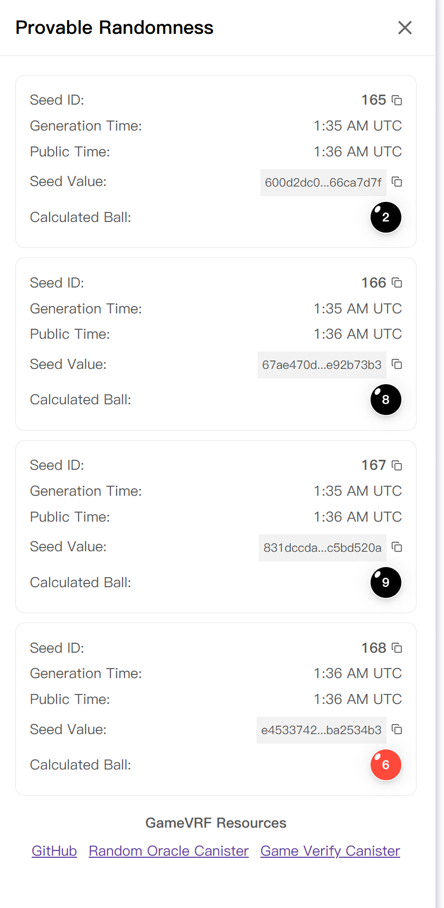
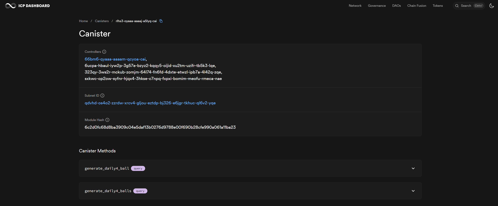
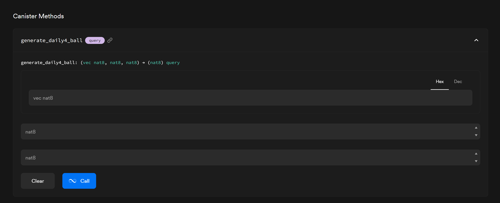
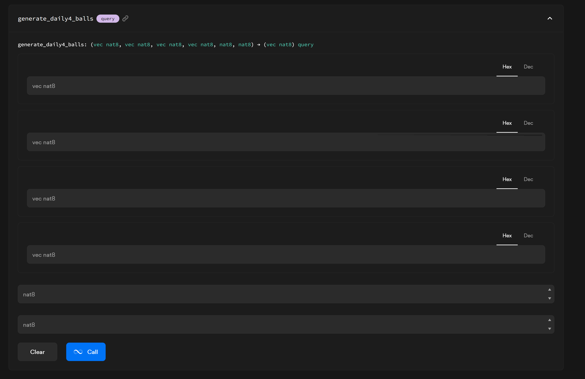

# Daily4 Randomness Verification Guide

Daily4 uses **provable randomness** so that every completed draw can be independently verified by users.

After each Daily4 draw is completed, users can view the seed values, generation time, and calculated ball result for each of the 4 balls. Users can then visit the **Game Verify Canister Dashboard** to confirm that the displayed Daily4 numbers were generated correctly and fairly.

---

## 1. What you see after a draw

After a Daily4 draw is finished, open the **Provable Randomness** panel for that draw.

For each ball you will see:

| Field | Description |
|---|---|
| **Seed ID** | Unique identifier for the seed |
| **Generation Time** | The time at which the seed was generated |
| **Public Time** | The time the seed became publicly available |
| **Seed Value** | The raw seed string used to derive the ball number |
| **Calculated Ball** | The ball number that was derived from the seed |

Daily4 has **4 balls**, and each ball is a single digit in the range **0 – 9**.

---

## 2. Game Verify Canister dashboard overview

There are two verification functions through canister dashboard:

1. **Get number by a single seed** — verify one ball at a time using one seed.
2. **Get 4 numbers by inputting 4 seeds** — verify all four balls at once by submitting all four seeds together.

You can use either method. Both will return the same calculated ball values shown in the Daily4 draw panel.

> **Number range for Daily4**
>
> Each Daily4 ball is a single digit, so the valid range is **0 to 9**.
> When entering range parameters in the dashboard, always use:
> - **Lower bound / minimum:** `0`
> - **Upper bound / maximum:** `9`

---

## 3. Step-by-step verification overview

1. Wait until a Daily4 draw is completed.
2. Open the draw's **Provable Randomness** panel and note the **Seed Values** and **Calculated Balls** for each ball.
3. Go to the **official ICP verification canister dashboard**.
4. Choose a verification method (single seed or four seeds).
5. Paste the seed(s) and set the range to `0` – `9`.
6. Run the function and compare the returned numbers to the **Calculated Balls** shown in Daily4.

---

## 4. Verify one number with one seed

Use this method to verify a single Daily4 ball individually.

**Steps:**

1. Open a completed Daily4 draw and open the **Provable Randomness** panel.
2. Copy the **Seed Value** for the ball you want to verify.
3. Note the **Calculated Ball** displayed for that seed.
4. Go to the official ICP verification canister dashboard.
5. Select **Get number by a single seed**.
6. Paste the copied seed into the seed input field.
7. Enter the Daily4 number range:
   - minimum = `0`
   - maximum = `9`
8. Run the function.
9. Compare the returned number with the **Calculated Ball** shown in Daily4.

**Expected result:** The returned number must exactly match the displayed **Calculated Ball** for that seed. Repeat for the remaining 3 seeds to verify all balls one by one.

---

## 5. Verify all 4 numbers with 4 seeds

Use this method to verify the complete Daily4 result in a single step.

**Steps:**

1. Open a completed Daily4 draw and open the **Provable Randomness** panel.
2. Copy all **4 Seed Values** in the order they are displayed.
3. Go to the official ICP verification canister dashboard.
4. Select **Get 4 numbers by inputting 4 seeds**.
5. Paste the 4 seeds into the 4 seed input fields, preserving the original order.
6. Enter the Daily4 number range:
   - minimum = `0`
   - maximum = `9`
7. Run the function.
8. Compare the 4 returned numbers with the 4 **Calculated Balls** shown in Daily4.

**Expected result:** The 4 returned numbers must match the Daily4 **Calculated Balls** exactly and in the same order.

For example, if Daily4 shows:

| Ball | Calculated Ball |
|---|---|
| Ball 1 | `2` |
| Ball 2 | `8` |
| Ball 3 | `9` |
| Ball 4 | `6` |

then the verification result must also return: `2, 8, 9, 6`.

---

## 6. Tips and common mistakes

- **Copy seeds exactly.** Even a single extra character will produce a different result. Copy the seed value directly from the panel without any modification.
- **Preserve seed order.** When using the 4-seed function, paste the seeds in the same order they appear in the Daily4 draw panel. Swapping seeds will produce different numbers.
- **Always use the correct range.** Daily4 balls are in the range `0` – `9`. Using any other values will produce incorrect verification results.
- **Verify only completed draws.** Seed values are only available after a draw is fully completed and published.
- **If the numbers match, the draw is verified.** A matching result confirms that the Daily4 balls were generated fairly using provable randomness.
